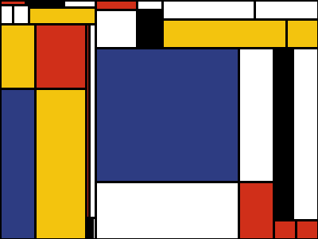

# pimondrian

**pimondrian** is a module conceived to create paintings in the style of _Piet Mondrian_ from number sequences. It also has a convenient command line utility.

.

Installation:

```
pip install pimondrian
```

pimondrian requires Pillow for draw an save images.

## As module

The `Painting()` class is used to create a painting.

```
Painting(iterations, iterator)
```

The algorithm works by dividing the canvas into two parts successively as a recursive tree, and in iterations the number of levels (excluding the root node) that this tree will have must be indicated.

To do this, in each division, it extracts digits three by three: The first number in each group of three is used to decide where the dividing line will be placed. For example, if the digit is 3, the division is placed at 3/10 of the total distance. The other two digits are used to decide the color of each of the new rectangles.

The digits must be provided with an iterator. The number of digits consumed is 3 * (2 ^ iterations - 1), so the algorithm uses 93 digits to generate a standard table with five iterations. If you don't have enough digits, zeros will be used instead. Zeros are boring, so it's better to provide enough digits.

The module has a `from_file_generator(file)` function that returns a generator from a file object. The file is expected to contain numbers. If the file contains any non-numeric characters, the generator will return a zero instead.

There is a file with the first 10000 digits of the number pi in the path defined in the constant `PI_DIGITS_FILE`. For convenience, there is also a `pi_generator()` function that uses that file to return a generator with the digits of Pi.

The module also has a function `random_generator()` that returns a random digits generator.

The `draw()` method of the `Painting()` class returns an image object from Pillow.

```
draw(line, colors, size, gen=None)
```

The line argument indicates the width of the border line around the rectangles.

The colors must be a list or tuple of ten elements, each one of them being a string with the color in hexadecimal in the "#RRGGBB" format.

You can use the from_file_colors (file) function to get a list of colors from a file object.

The color file must have (at least) one row for each color in the "#RRGGBB" format indicated above. For example:

```
#FFFFFF
#FFFFFF
#FFFFFF
#AA0000
#AA0000
#0000AA
#0000AA
#000000
#000000
#AAAA00
```

If the file has more than ten rows, the rest will be ignored.

The file with colors in the path defined in the `COLORS_FILE` constant can be used. For convenience, there is also a `default_colors()` function that will return those colors.

The size is indicated in size with a tuple in the shape (width, height).

The optional argument gen indicates the "generation" (that is, the level of depth in the tree of rectangles) from which you want to extract the rectangles to draw the box. Its main utility is to be able to generate a "history" of painting level by level. If not indicated, the last level will be used.

The `save_png()` method is similar to `draw()`, but it generates a PNG file with the name indicated in the name argument followed by the extension ".png".

```
save_png(line, colors, size, name, gen=None)
```

Example:

```
import pimondrian
iterator = pimondrian.pi_generator()
colors = pimondrian.default_colors()
my_painting = pimondrian.Painting(5, iterator)
my_painting.save_png(4, colors, (1200, 800), "PiMondrian")
```

## As command line program

In addition to its use as a module, **pimondrian** can also be run as a standalone application using the `pimondrian` command.

Usage:

```
pimondrian [-h] [-f FILE] [-c COLORS] [-n NAME] [-g GALLERY]
           [-y Y_SIZE] [-x X_SIZE] [-i ITERATIONS] [-l LINE]
```

optional arguments      | Usage
------------------------|-------------------------------- 
 -h, --help            | show this help message and exit
 -f FILE, --file FILE  | path of the file containing the numbers. If not specified, the first 10000 digits of Pi will be used
 -c COLORS, --colors COLORS | path of the file containing the colors
 -n NAME, --name NAME  | painting name. The default value is PiMondrian
 -g GALLERY, --gallery GALLERY| number of generated paintings
 -y Y_SIZE, --ysize Y_SIZE | painting height. The default value is 800
 -x X_SIZE, --xsize X_SIZE | painting width. The default value is 1200
 -i ITERATIONS, --iterations ITERATIONS | number of iterations in the creation of the painting. The more iterations, the more rectangles. The default value is 5
 -l LINE, --line LINE  | line thickness. The default value is 4
 -r, --random  | use random numbers instead of a file

Examples:

Can be executed without arguments:

```
pimondrian
```

This is te command for create the painting in the header of this document:

```
pimondrian -x 400 -y 300 -l 2 -n mondrian_cover
```

These two commands have the same effect:

```
pimondrian -n Paint -i 4 < my_numbers.txt
pimondrian -f my_numbers.txt -n Paint -i 4
```

Using standard input to inject random numbers:

```
cat /dev/urandom | tr -cd '[: digit:]' | pimodrian
```